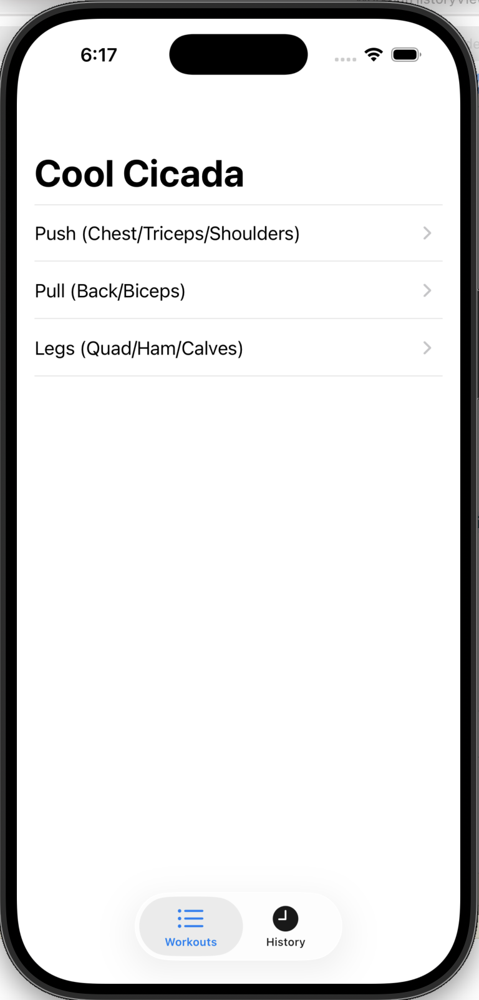
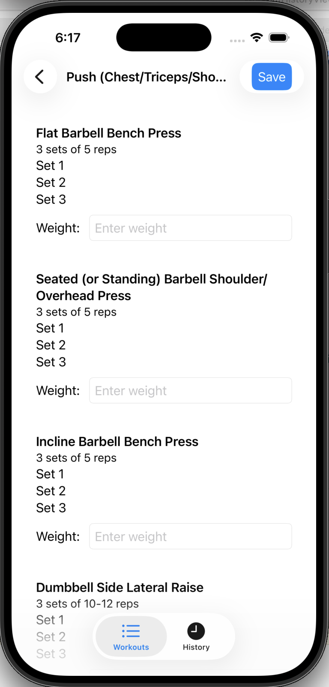
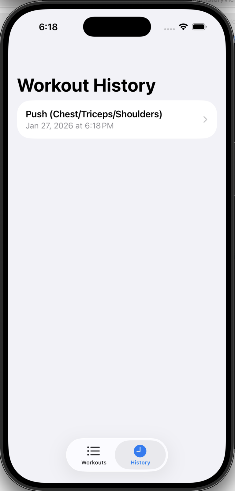
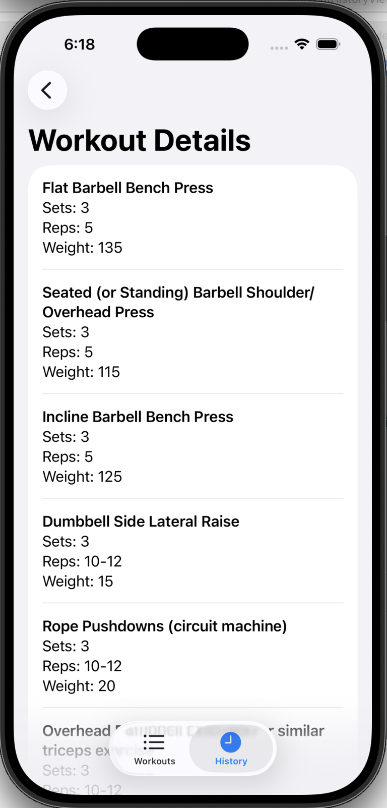

# Workout Tracker (Swift + SwiftUI)

A workout tracking app built in Swift with SwiftUI for the interface.  
Track workouts, log exercises with sets, reps, and weight, and view your workout history.

---

## Overview

Workout Tracker lets users manage and log their training sessions in a simple, intuitive interface.  
- Start workouts with pre-defined templates or create custom routines.  
- Log exercises with sets, reps, and weight.  
- Track performance over time with a dedicated workout history.  

  

---

## Workouts

The app comes with three primary workout types:

- **Push** – exercises targeting chest, shoulders, and triceps.  
- **Pull** – exercises targeting back, biceps, and rear delts.  
- **Legs** – exercises targeting quadriceps, hamstrings, glutes, and calves.  

Users can also create custom workouts combining exercises from these categories.

---

## Inside a Push Workout

When selecting a Push workout, users can:

- View all exercises in the routine  
- Log sets, reps, and weights for each exercise  
- Track progress during the session  

  

---

## Workout History View

Completed workouts are automatically saved to history.  
The Workout History view allows users to:

- Browse past workouts by date  
- See workout types and summaries at a glance  
- Quickly select any past session for details  

  

---

## Inside a Past Workout

Selecting a historical workout opens the Workout Details view for that session. Users can:

- Inspect all exercises logged during that session  
- Review sets, reps, and weights  
- Track progress and compare performances over time  

  

---

